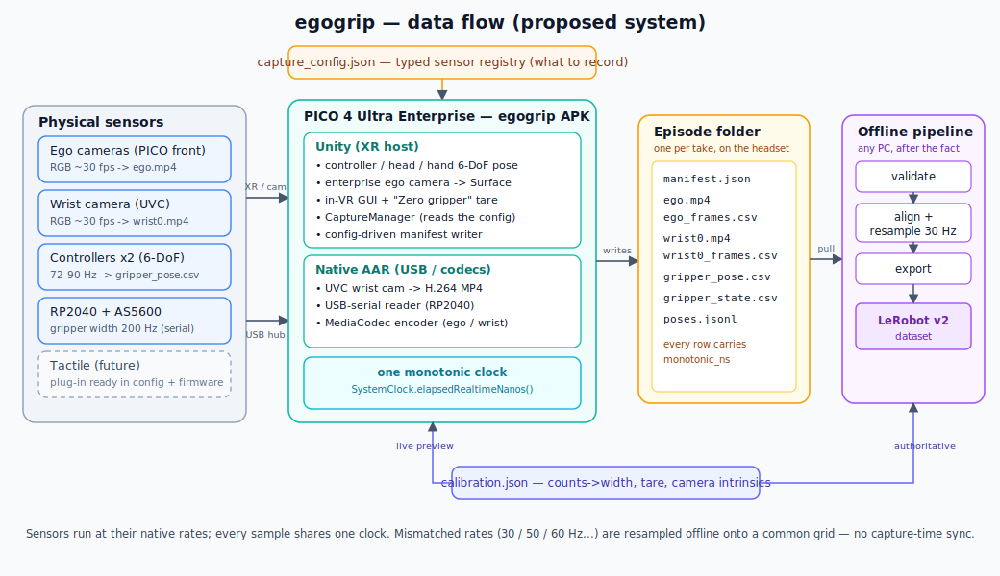
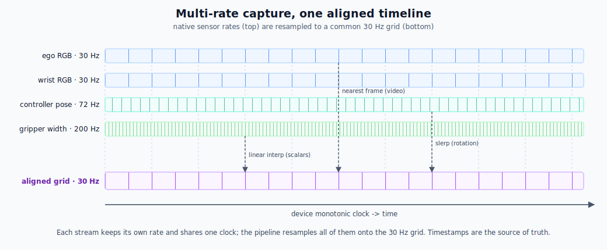

# egogrip

**A self-contained, headset-only data-collection system for robot learning.**

`egogrip` turns a **PICO 4 Ultra Enterprise** headset plus a hand-held **UMI-style mock
gripper** into a portable, multimodal demonstration recorder. An operator wears the headset,
holds the mock gripper, and performs a task. The system records **egocentric RGB**, a
**wrist camera**, **tactile**, **gripper width**, and the **6-DoF pose of the gripper** —
all time-aligned — and writes episodes that convert to a
[LeRobot](https://github.com/huggingface/lerobot) dataset for imitation / VLA training.

It is inspired by [EgoKit](https://www.chuange.org/papers/EgoKit.html) (the egocentric
capture workflow) and [UMI](https://umi-gripper.github.io/) (the hand-held gripper as an
action interface), and tries to fix their biggest gaps: **no tactile, no depth, no gripper
state, and loose timing**.

> Status: **active build**. Architecture and the upgrade plan are locked
> ([docs/UPGRADE_PLAN.md](docs/UPGRADE_PLAN.md)); a working offline pipeline, a native capture
> spine, and reference firmware already exist. In progress: a JSON-driven sensor registry,
> Arduino-Pico AS5600 gripper firmware, on-device ego/wrist video, and unification onto one
> Unity-hosted app. See [docs/ROADMAP.md](docs/ROADMAP.md) for the phased build plan.

---

## System data flow

The whole system, from physical sensors to a trainable LeRobot dataset. Sensors connect over a
powered USB-C hub (UVC cameras + the RP2040 gripper MCU over serial) or the XR runtime (controllers,
enterprise ego camera). The on-headset app stamps every stream against **one monotonic clock** and
writes a self-describing episode folder; an offline pipeline aligns and exports it. What gets
recorded is driven entirely by an editable **`capture_config.json`**.



Sensors record at **different native rates** and are never hardware-synced at capture time. Each
sample is timestamped on the shared clock, and the pipeline resamples everything onto one uniform
grid (default 30 Hz) — linear interpolation for scalars, slerp for rotation, nearest-frame for
video. So a 30 Hz camera and a 200 Hz encoder line up with no special handling.



> The diagrams are SVG (XML) under [docs/diagrams/](docs/diagrams/) — edit the source to update them.

## Why this exists

Egocentric human demos are the cheapest way to get manipulation data at scale, but existing
kits stop short of being directly trainable:

| Capability | EgoKit | UMI | **egogrip** |
|---|---|---|---|
| Ego RGB | ✅ | (head GoPro) | ✅ (PICO enterprise camera API) |
| Wrist camera | ✅ (2×) | ✅ | ✅ (1×, schema supports N) |
| Hand/head pose | ✅ | — | ✅ |
| **Gripper 6-DoF pose** | ❌ | ✅ (SLAM, post-hoc) | ✅ (**controller on gripper, live**) |
| **Gripper width (action)** | ❌ | ✅ | ✅ (AS5600 encoder → MCU) |
| **Tactile** | ❌ | optional | ✅ (**pluggable**, MCU array reference) |
| Depth | ❌ | mirror-stereo trick | ⚠️ investigating (PICO scene/iToF access is limited) |
| Time sync | timestamps only | hardware-ish | one monotonic clock + offline resample |
| Trainable output | raw MP4 + logs | UMI pipeline | **LeRobot exporter** |
| Needs a PC to operate | no | yes (post) | **no — fully on-headset** |

## Key design decisions

These were chosen deliberately; rationale lives in
[docs/DESIGN_DECISIONS.md](docs/DESIGN_DECISIONS.md).

- **Device:** PICO 4 Ultra **Enterprise** — required for app-level passthrough RGB via the
  enterprise camera API. (Consumer PICO does not expose it.)
- **Gripper pose:** a PICO **controller strapped to the gripper** gives accurate live 6-DoF
  with zero custom CV.
- **Tactile:** a **pluggable sensor interface**; the reference implementation is a low-cost
  pressure/force array on the MCU.
- **App stack:** **Unity + a native Android AAR plugin** — Unity for the PICO XR SDK
  (controller/hand/head pose, enterprise passthrough) and the in-VR GUI; the AAR for USB
  UVC cameras and USB-serial where Unity is weak.
- **Output:** a clean **raw capture format** on-device, converted **after the fact** to
  **LeRobot v2**.
- **Sync:** all streams stamped against **one monotonic device clock**; hooks for an
  optional hardware sync pulse (LED + MCU) to bound drift.
- **Operation:** **self-contained on the headset** — capture, store, and verify need no
  companion computer. Conversion/training happen offline.
- **MCU:** **RP2040 (Raspberry Pi Pico)** reference firmware; ESP32-S3 is the wireless
  upgrade path.
- **MVP:** **single gripper**, but the schema and config are **N-sensor** so bimanual is a
  config change.

## Repository layout

```
egogrip/
├── docs/              architecture, data format, sync, hardware, roadmap, decisions,
│                      PORTABILITY, PICO_TOMORROW (setup runbook), NATIVE_APP_PLAN, adapters/
├── app-native/        native Android (Kotlin) capture app — serial + episodes  [WORKING]
├── app/               Unity APK (in-VR GUI + pose + enterprise camera)  [scaffold]
├── native-plugin/     Android AAR: UVC cameras + USB-serial bridge      [scaffold]
├── firmware/          RP2040 — CircuitPython ref [WORKING] + Arduino-Pico/AS5600 [building]
├── pipeline/          Python: raw capture → LeRobot dataset             [WORKING]
├── hardware/          mock-gripper CAD plan + BOM
├── schema/            capture config + episode manifest formats (JSON Schema)
└── configs/           ready-to-edit sensor registries (single / dual gripper)  [planned]
```

## How it fits together (one paragraph)

A single **`capture_config.json`** (a typed sensor registry) declares which sensors to record, so
adding or retuning a sensor is a config edit, not a code change. The **gripper MCU** (RP2040 +
**AS5600** magnetic encoder) streams gripper width over **USB-serial** into a **powered USB-C
hub**; tactile is wired into the same protocol for later. A **wrist camera** (UVC) plugs into the
same hub, which connects to the headset's single USB-C port (with PD pass-through so the headset
charges while recording). The **APK** on the headset reads the **enterprise ego RGB** + **controller
6-DoF pose** + **hand/head pose** internally, and the **wrist camera + serial** via the native
plugin. Every sample is stamped against one monotonic clock and written to an **episode folder** on
the headset. Later, the **pipeline** pulls episodes, resamples the streams onto one timeline, and
exports a **LeRobot** dataset. Full detail: [docs/ARCHITECTURE.md](docs/ARCHITECTURE.md).

## Getting started
Download the latest .apk app file from app/Assets/Builds to the PICO 4 Ultra headset. Run the .apk application on your headset to install, and enjoy!
   camera access (the long-lead item).

## License

MIT — see [LICENSE](LICENSE).
